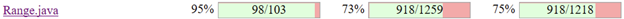
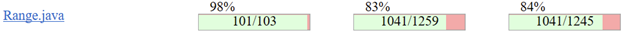

**SENG 438 - Software Testing, Reliability, and Quality**

**Lab. Report #4 – Mutation Testing and Web app testing**

<table>
  <tr>
   <td>Group #:
   </td>
   <td>
   </td>
  </tr>
  <tr>
   <td>Student Names:
   </td>
   <td>
   </td>
  </tr>
  <tr>
   <td>Rian Opperman
   </td>
   <td>30118288
   </td>
  </tr>
  <tr>
   <td>Tanish Datta
   </td>
   <td>30107335
   </td>
  </tr>
  <tr>
   <td>Arushi Gupta
   </td>
   <td>30121257
   </td>
  </tr>
  <tr>
   <td>Seniru Ruwanpura
   </td>
   <td>30122157
   </td>
  </tr>
</table>

# Introduction

Mutation testing and GUI testing are two important methods used in software testing to improve the quality of the code and ensure that it meets the required specifications. Both methods help to find edge cases and improve the robustness of the program.

Mutation testing involves substituting different variables and operations into test suites to check how the program responds to different scenarios. By using automated tools like Pitest, software developers can quickly identify which mutants have "survived" and which ones have been "killed" during the testing process. This approach saves time and effort that would otherwise be spent manually generating test cases and can help to improve the quality of the program by identifying previously unknown errors or vulnerabilities.

GUI testing, on the other hand, involves testing the front-end of the application to ensure that it is functioning correctly and providing the intended user experience. This type of testing is particularly useful for regression testing, which involves testing the functionality of the application after making changes to the back-end code. By using tools like Selenium, developers can create automated test cases that simulate user interactions with the application and check that the expected output is generated.

In summary, both mutation testing and GUI testing are essential methods in software testing that can help to identify edge cases, improve the robustness of the program, and ensure that it meets the required specifications. By using automated testing tools, developers can save time and effort while improving the quality of their code.

# Analysis of 10 Mutants of the Range class 

## `getCentralValue()`

### Substituted 2.0 with 1.0 - Killed

When 2.0 is substituted with 1.0 the code changes from `return this.lower / 2.0 + this.upper / 2.0;` to `return this.lower / 1.0 + this.upper / 2.0;`. This mutant was killed because for any of our test cases the value returned is not the same as the expected value. For example, with a range of (-5, 5), we should get 0, but instead we get -2.5 with the mutated code, so the mutant is detected and killed.

### Replaced double addition with modulus - Survived

When the addition operator is changed to modulus, the code changes from `return this.lower / 2.0 + this.upper / 2.0;` to `return this.lower / 2.0 % this.upper / 2.0;`. This mutant survived because our only test with this method used a range of (-5, 5) and as such when the operator is changed the output doesn’t change as -2.5 + 2.5 = 0 and -2.5 % 2.5 = 0.

### Incremented (a++) double field lower - Survived

When the lower field is incremented via the postfix method, the code changes from `return this.lower / 2.0 + this.upper / 2.0; `to` return this.lower++ / 2.0 + this.upper / 2.0;`.  This mutant survived because when we postfix increment the lower data member, the data member is first read and used in the calculation and when the instruction counter moves to the next line the data member is updated. Because of this, it is impossible to detect the mutant as the value is only updated after it is used, so there is no way to distinguish between the mutant and the correct original code.

### Decremented (--a) double field upper - Killed

When the upper field is decremented via the prefix operator, the code changes from `return this.lower / 2.0 + this.upper / 2.0;` to `return this.lower / 2.0 + --this.upper / 2.0;`. This mutant was killed because when we prefix decrement the upper data member, the value is updated before it is used, and as such when we use the range [-5, 5] we go from -2.5 + 2.5 = 0 to -2.5 + 2 = -0.5. Since the values differ, it means we detected the mutant and as such, the mutant was killed.

## `contains()`

### Replaced boolean return with false for org/jfree/data/Range::contains - Killed

When the return is set to false for contains, the code changes from `return (value >= this.lower && value &lt;= this.upper);` to `return false;`. If we then have a test range of (-5, 5) and use 3 as the argument for contains, we originally get true, but with the mutation we get false. In this way we kill the mutant as we have detected it in our tests.

### Replaced return of integer sized value with (x == 0 ? 1 : 0) - Killed

When we replace the return of the function to the provided statement, our code changes from `return (value >= this.lower && value &lt;= this.upper);` to `return (x == 0? 1 : 0);`. When we run this function with a test range of (-6, -3) and an input parameter of 0, we originally get false, but with the mutated code we get true. In this way we kill the mutant as we have detected it in our tests.

### Negated double field upper - Killed

When we negate the data member upper, our code changes from `return (value >= this.lower && value &lt;= this.upper);` to `return (value >= this.lower && value &lt;= -this.upper);`. When we test this method with a range of (-5, 5) and an input parameter of 0, originally we get true, but in the mutated version the output is false. In this way we killed the mutant as we have detected it in our tests.

## `intersects()`

### Changed conditional boundary - Survived

When we change the conditional boundary, our code changes from `if (b0 &lt;= this.lower)` to `if (b0 &lt; this.lower)`. None of our original tests really worked on the boundary value of `b0 = this.lower`, and as such this mutation went unnoticed. For example, if we have a test range of (-5, 5) and input the parameters -10 and -6, in both the original and mutated case the output of the function will be false. Since our output from the test hasn’t changed, we have not detected the mutant and as such it has survived.

### Negated conditional - Killed

When we negate the conditional statement, our code changes from `if (b0 &lt;= this.lower)` to `if (b0 > this.lower)`. When we test this method with a range of (-5, 5) and parameters of 6 and 10, we originally get false and the mutated version returns true. As we can see, since the outputs of the original and mutated version differ, we have detected the mutant, thereby killing it.

### Greater than to greater or equal - Survived

When we convert the greater than to a greater than or equal to operator, our code changes from `return (b1 > this.lower);` to `return (b1 >= this.lower);`. None of our original tests handled the case where `b1 = this.lower`, and as such the mutant survives. For example, if we have the test range of (-5, 5) and input parameters of -10 and -6, we originally get false and with the mutated version we get false as well. Because the output of the function does not change between the original and mutated case for our input, the mutant survives and our test cases need to be adjusted to kill the mutant.

# Report all the statistics and the mutation score for each test class

Columns are Line Coverage, Mutation coverage and Test Strength from left to right:

**Original:**

**Updated:**

# Analysis drawn on the effectiveness of each of the test classes

**Range Class**

range New Mutation Score **83%**

For range class, we were able to increase the mutation score by 10%. In assignment 3, our mutation test score was 73%, but now after killing several mutants, we have increased our mutation score to 83%. As we killed several mutants, it became harder to catch them. In this case, by killing those mutants, we have increased the test case power and the accuracy of the test case to reveal any errors. \
To increase the mutation score further we would need to kill more mutants, however that becomes more difficult as a lot of the left over mutants are either equivalent or cannot be interacted with directly. This results in Range never having a mutation score of 100% due to these unkillable mutants, however despite this the tests still are quite effective as they cover most of the created mutants.

**DataUtilities Class**

dataUtilities New Mutation Score **89%**

For this class, we weren’t able to increase this mutation test score by 10%. We were able to kill a few mutations in order to get a 1% percent increase. This is due to the fact that the previous test suite had a very in depth approach to testing DataUtilities so therefore many of the mutants were already killed beforehand. While looking at the remaining mutants, most of them are considered as equivalent mutants which means that these mutants have the same behaviour as the original program. This means any equivalent mutants encountered are impossible to kill. Due to this fact, mutation testing can sometimes be inacurate as the killed mutant score is compared against the total number of mutants. In our case, we have a total of 687 mutants and only 614 mutants were killed. This leaves us with a total of 73 that survived.

# A discussion on the effect of equivalent mutants on mutation score accuracy

Equivalent mutants adversely affect our accuracy results, as there is no way to kill them since they provide no condition or effect that can be exploited to kill the mutant. In our test suite we had quite a few unkillable mutants due to them being equivalent, like postfix incrementing certain variables, which are only used in a condition or in returning a value, which are unkillable since we cannot see their effects in the results of the tested functionality. Other equivalent mutants which we encountered were converting a greater than operator to a greater than or equal to operator for certain conditions which had no effect at all on the outcome of the method, meaning it was an equivalent mutant and muddied the accuracy. \
In general, equivalent mutants create a glass ceiling for what the mutation score can really be, as they cap how high the mutation score can go. They also provide some sense of inadequacy in the tests as ideally we want 100% coverage, but due to these equivalent mutants it makes it virtually impossible, yet these mutants do nothing and as such if we only have equivalent mutants left we in essence have a mutation score of 100%.

# A discussion of what could have been done to improve the mutation score of the test suites

To improve mutation scores of our original test suite we went through the surviving mutations and created tests targeting those surviving mutants. Additionally, for each of these surviving mutants we analyzed them to determine what input values would kill said mutant. To increase our mutation score further we would do a similar approach as there is no real automated or easy way of increasing mutation scores; the best way to increase it is by manually analyzing the mutants and creating new test cases. \
This method generally does work for increasing mutation score, however quite a few of the surviving mutants are unreachable or equivalent. As discussed in the section above, equivalent mutants hinder our score as they are technically invincible mutants that cannot be killed. Similar to these mutants we have unreachable mutants which we cannot directly target or which are impossible to target. For the min and max methods of the Range class, we are unable to directly target them as they are private methods and as such can only rely on transitive means of testing them. This means then that these methods are frankly unreachable, due to the reliance and heavy coupling on other methods needed to test these methods.

# Why do we need mutation testing? Advantages and disadvantages of mutation testing

Mutation testing is needed to verify that our test cases are working correctly and can differentiate between erroneous and correct behaviour for the system under test. Without it we could only verify by manually inspecting the test code, which would take much longer than the automated mutation testing methods that are available.

The advantages of mutation testing are mainly that we are verifying our tests work correctly, and even if we have some mutants left alive in the test suite, mutation testing provides a guide on what tests need to be implemented for a more robust and thorough test suite.

The disadvantages of mutation testing is that it is much more computationally intensive and takes a lot longer to run when compared to other testing methods, like Black Box or White Box testing. This is due to the fact that automated mutation testing needs to modify our code slightly and then run our tests on it to see if it can kill the mutant. This means our tests aren’t being run once, like in White Box or Black Box, but instead multiple times each with a new mutation, which leads to an increase in overall testing time.

# Explain your SELENIUM test case design process

Before we began designing our test cases, and splitting into smaller teams/individual tasks, the team first began exploring the functionality of the IKEA website. We began making a list of possible GUI tests that we wanted to execute such as those related to login, changing the address, changing site logistics, and shopping functions. In tandem with this, we also explored how exactly Selenium worked in terms of manually inputting different test data or manually doing new tests, and then how it recorded that information to automatically go back in and redo the test to make sure that it worked. Something that we quickly found out was how you could not do a successful log-in test for example, without also including a log-out, otherwise, the test would not reset on the website. Without the log-out being included, the next person going in to test the software would run a test failure as instead of logging in again, it would log out and then the IDE would not know what to do. Presented with this reality, we split up the tests such that we effectively had paired tests for the functionality of the website, giving up 2 tests each to a group member that would test one functionality of the site but would need to use two tests minimum to test different data. 

Rian covered the login and logout, which was one test for valid, and one test for invalid user input that the site needed to reject. He also wrote an extra test to cover invalid log in details to ensure that the site rejected users with either a wrong username or password, such that the site wouldn’t recognize one element being correct and thus let the user in.Tanish covered the postal code, with one test changing the postal code with valid input, and another test putting in bogus information for the site to send an error message. Arushi’s two tests centered around changing the site language and location, in which the language was changed from English to French and back to English, and then changing the site location from Canada to the United States and back to Canada. This reversal was necessary, or otherwise, as explained earlier the test would run failures in future runs as the test data would be linked to a wrong input. Seniru did the remaining two, which included adding an item to the cart (which did not require any return to reset the site to the default), and changing the store location (which did require a return). The adding item to cart also additionally checked the search functionality within the overall scope of the test. In his site exploration, Seniru also found the search by image function and attempted to make a test for that, but this was the only test that ran a failure. This was not due to a bug within IKEA’s functionality but rather a limitation of Selenium whereby it could only test things within the browser, and if other user elements were added it could not detect that and would thus run a failure. Our tests ensured that both site redirections were correct, but also that the input data was correct as well. 

# Explain the use of assertions and checkpoints

In Selenium, assertions and checkpoint are used in order to make sure that the system that’s being tested is behaving as expected. Selenium allows this to happen efficiently as it is automatically done by the application. It places these validations after all forms of user input such as scroll, click, or inputted text. While running the test cases, if one input is incorrect, it will stop at that breakpoint and will send out a failure, and if you are running everything together, it will move onto the next test case. Additionally, for every single test case that was run, a manual verification point was needed by adding a verify text element to each test case. If this was not added, the test would still be successful, however, it would be unclear why it was successful unless one was to go back to the IKEA site and see the message there. By adding it, that message was added to Selenium, and thus, a more concrete test was created. 

# How did you test each functionality with different test data

When using Selenium, we tested out 10 different functionalities. This functionalities were: 

* Login/logout valid  
>* First tested by creating an username and password, then using those as input, the login and logout functionality was tested. The user first logged in and then logged out to reset the test.
* Invalid username 
>* Test by inserting a username that never existed even though the password was valid for a different username.
* Invalid password 
>* A correct username was inputted, but an invalid password was inputted that was not associated with the username
* Change language 
>* This was done by change the input via the dropdown menu for different languages, and then changed back to the original language via the same manner.
* Change site location
>* The change country button is a link to another ikea web page where there was a dropdown menu to select website location (.ca(en), .ca(fr), .us).
* Change location of store 
>* A dropdown menu gave two options, one was a list of stores based on correct postal code input and the other was a full list of stores.
>* A default store was first selected, then based on the list, store location was changed by searching for a location. Once this was done, the original store location was selected through the postal code.
* Postal code valid 
>* Changed or inputted a valid postal code (LetterNumberLetterNumberLetterNumber)
* Postal code invalid 
>* Inputted an invalid postal code that rejects the above notation
* Add item to cart 
>* Added a table to cart and made sure that the site recognized this addition
* Search by image
>* Attempted to search the site not by textual basis but by image search, which caused a failure due to Selenium’s limitations

Test cases such as login had effectively three separate cases. Each were created as we wanted to test different outcomes of the system to make sure IKEA’s functional requirements were working as expected. Some such as adding items to cart, had only one scenario to work with so only one test was created. Further testing can be done by changing the value field in Selenium, but this would involve tampering with the test case, so we did not do this method, instead preferring to just create more tests. 

# Discuss advantages and disadvantages of Selenium vs. Sikulix

Selenium and Sikulix are two of the most popular frameworks used in industry and personal projects for Web-based application as well as GUI based application. However, due to the nature of the development of the program, both applications have their pros and cons. 

Selenium is a widely used testing framework that offers several advantages for web-based applications. It supports multiple programming languages, including Java, Python, and Ruby, making it accessible for developers with different language preferences. Selenium also supports cross-browser testing, which allows tests to be run on different browsers and platforms to ensure consistent performance across different environments. Additionally, it can be integrated with various testing tools and frameworks for added functionality. However, Selenium can be difficult to set up and configure, especially for those new to the framework or automated testing in general. It also requires a web driver to interact with the browser, which can cause compatibility issues or performance problems. Finally, Selenium is primarily designed for web-based applications and may not be as effective for testing other types of software, such as desktop or mobile applications.

SikuliX is a visual testing framework that uses image recognition technology to interact with the user interface. Its main advantages include its ease of use and versatility across multiple operating systems. SikuliX is open-source and requires little programming experience to set up and use. Additionally, it is effective for testing GUI-based applications and supports automation testing, scripting, and automation of repetitive tasks. However, SikuliX relies on image recognition technology, which can be less reliable than other testing methods. It may also not be as effective for testing web-based applications or for testing across different browsers and platforms. Finally, SikuliX requires more memory and processing power than other testing frameworks, which can affect performance on some systems.

# How the team work/effort was divided and managed

The overall work was divided between the two teams equally, team 1 being Arushi and Seniru, while team 2 was composed of Rian and Tanish. For the mutation tests the groups stuck to their previous classes as they had the most experience working with them. This is to say that Arushi and Seniru worked on the DataUtilities class while Rian and Tanish worked on the Range class. Such a breakdown was based on our involvement in previous labs where this was the breakdown, and thus switching at this point would create confusion. For the GUI portion of the lab the work was divided equally between the members; meaning each member had to design and record 2 test cases.  \
The work was managed through virtual meetings and group chats, where we communicated on certain difficulties and checked in on one another to see how each person's portion of work was going.

# Difficulties encountered, challenges overcome, and lessons learned

One major difficulty we encountered was that for mutation testing the runtime of the tests was absurd; we generally had to wait 20+ minutes to get the results for a mutation test. To combat this we stripped down the codebase to only the essential components that were being tested, that is to say the Range and DataUtilities class. From this experience we learned that in general mutation testing is not something that should really occur in one big code base as the time it takes to execute grows almost exponentially. It is then a much better idea in testing to focus only on certain classes and if possible try to separate them from the other classes as mutation testing tools like Pitest still create mutations for classes which are not target. This is to say if we are running mutation tests on the RangeTest class and we have the DataUtilities class as well as other classes in the directory, Pitest will still generate mutations for those classes. As well, some of the descriptions of mutants were quite obtuse and vague as to what they changed since Pitest only gives a description of what was done and not a code snippet to show what changed. This made it quite difficult to kill certain mutants as we did not know what those mutants were. To rectify this we used the documentation provided on the official Pitest site which describes what each mutation description actually does to the code. 

During this lab, we learnt how effective mutation testing was compared to the black box testing and white box testing used in the previous labs. We also found out the limitations of not knowing the code and making tests based on method descriptions as well as how code coverage is not as accurate as mutation coverage when it comes to creating well rounded tests. Mutation testing is a very in depth procedure to review an application through several aspects even though it can be inaccurate occasionally if there are any equivalent mutation tests.

When working with Selenium, we found many major difficulties. First and foremost, the IDE was incredibly laggy and would often crash. Thus, important functionalities that we wanted to test such as favourites were not only hard to test, but bordered on impossible as everytime we tried to do it, the IDE would crash. This was not something we really overcame, but we simply explored the site as comprehensively as possible such that we could find other tests to run to make sure IKEA was working properly. This same error extended to trying to test out our entire suite. We noticed that if we ran the tests individually, every test (except the image one which was supposed to run a failure) passed successfully. If we ran the tests together, however, around halfway all the tests would fail simply because there would be too much load on Selenium. This is something that must also be noted for grading as tests which are successful suddenly fail if you run together. The final difficulty for GUI testing we encountered was in the beginning where we noticed that some tests would fail in future iterative runs if it was not reset. An example of this was with changing the site language from English to French, where if you did not change it back to English within the test, if you ran the test again, as it was looking for the verification point of text in French which was not present, the test would not be able to proceed. Thus a site functionality that obviously worked would show a failure simply due to the limitation of Selenium. We overcame this challenge through finding a way of resetting, but overall this is something that is a challenge of scripted testing as it cannot reset site settings unlike something with JUnit where tests relate to how code is written. 

Overall, though, we learnt a lot about how GUI and automated testing works. It was quite a fun process to go through, however, it was just annoying at times with some of the clear weaknesses with the Selenium software. We also learnt the difference between manual and automated GUI testing, with Selenium starting off with manual testing where we created a script, and then it would run the script again through automated GUI testing. 

# Comments/feedback on the lab itself

In general we felt the lab was quite vague and there should have been more guidance in this lab. Specifically, with mutation testing taking a fortnight to complete we wondered how we could ever realistically run everything quickly so that we could validate if our new tests killed specific mutants. We also thought that the lab demo should’ve consisted of how we could improve our overall mutation testing from our old test suites that were created in A3. This is because we felt that we spent hours creating new test cases just to demonstrate old test cases. This could’ve included explaining how we were able to get rid of the survived mutant and why it was important to do so.

Regarding GUI testing and Selenium, much of our criticisms still applied in terms of instructions being very vague. Selenium on its own and without its limitations such as lag, is a very simple IDE to work with, so the ease of simply automating a script based on previous user interaction was something that felt almost too simple, and thus we were unsure until consultation with many other individuals, TAs, and more, that what we were doing was correct. Having a detailed process of exactly what we needed to do instead of just “design your UI test cases” and “automate them” would have made sure that we knew we were on the right track and would have saved a lot of time. Such instructions were provided in our old labs, and that level of detail would have been perfect for us. Though admittedly external resources were provided for us to look at, one of these sites didn’t even work which wasn’t a great experience for us. The lessons from this lab were invaluable in gaining a practical understanding of mutation testing and GUI testing, but if more details were given we would have saved more time and had a better understanding of the overall concepts that we were supposed to learn in this lab.
